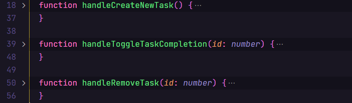

<h1 align="center"> React Challenge Completed</h1>

<p> 🖥️ Three challenges launched by <a href="https://rocketseat.com.br/" target:"blank">Rocketseat</a>, which we must create one function for each challenge, using the hook <a href="https://reactjs.org/docs/hooks-reference.html#usestate" target:"blank"> useState</a>, <a href="https://medium.com/poka-techblog/simplify-your-javascript-use-map-reduce-and-filter-bd02c593cc2d" target:"blank">Array Functions</a>, and among other details in ReactJS.</p>


Table of contents
=================
<!--ts-->
   * [Table of contents](#table-of-contents)
   * [About the Challenge](#about-the-challenge)
   * [Installation](#installation)
   * [Technology](#technology)
<!--te-->


About the Challenge
===================


<h3> Open the folder ./src/components/TaskList : </h3>
<p> 🗡️ In the function <Strong>handleCreateNewTask</Strong>, you need create a new task with id random.</p>
<p> 🗡️ In the function <Strong>handleToggleTaskCompletion</Strong>, toggle the isComplete field between true or false, using the id number.</p>
<p> 🗡️ In the function <Strong>handleRemoveTask</Strong>, remove a task the list by id.</p>

<p>⚔️ The challenge is completed, if you want to solve this challenge, remove the content from functions and enjoy it! ⚔️ </p>

Installation
============
```
#Clone the repository
  $ git clone git@github.com:KevinMCruzP/challengeReact.git
```

```
#Install the dependencies
  $ npm install

or

  $ yarn
```

```
#Run the app in http://localhost:8080/
  $ npm run dev

or

  $ yarn dev
```

```
#Automatic mode to evaluate the challenge
  $ npm run test

or

  $ yarn test
```


Technology
==========
🛠 Tools used in the construction of the project
- [React](https://reactjs.org/)
- [TypeScript](https://www.typescriptlang.org/)
- [JavaScript](https://developer.mozilla.org/en-US/docs/Web/JavaScript)

<p align="center" styles="color:#572364"><strong>networking 📩</strong></p>
<p align="center"> 
  <a href="https://www.instagram.com/kevin.pizarro.cruz/" target="blank">
    
  </a>
  <a href="https://www.linkedin.com/in/kevin-marlon-pizarro-cruz-22b369208/" target="blank">
    
	  
  </a>
</p>
<!-- 
<h4 align="center"> 
	🚧 README in construction... 🚀 🚧
</h4> -->
